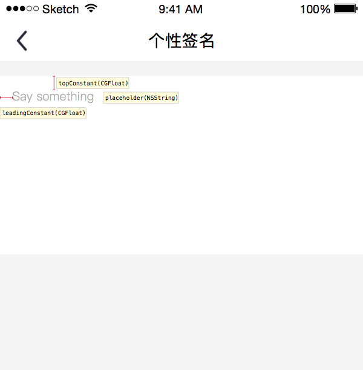
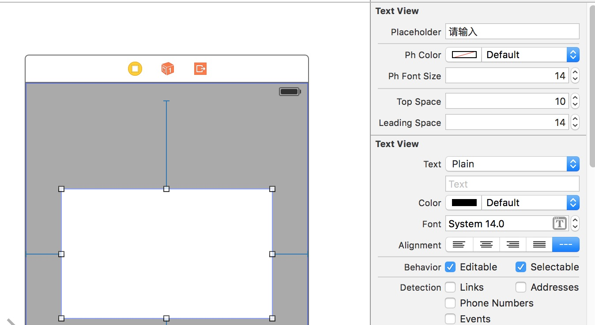

# LCTextView


支持 placeholder 的UITextview



##使用
Cocoapods:

```
pod 'LCTextView'
```

##功能

支持直接在IB中设置属性




同样也支持外部设置

```
self.textView.leadingConstant = 10.0f;
self.textView.topConstant = 10.0f;
self.textView.placeholder = @"请输入";
self.textView.placeholderColor = [[UIColor grayColor] colorWithAlphaComponent:0.7f];
```

##要求
* iOS 7 或更高
* ARC

##License

[MIT](http://mit-license.org/)
